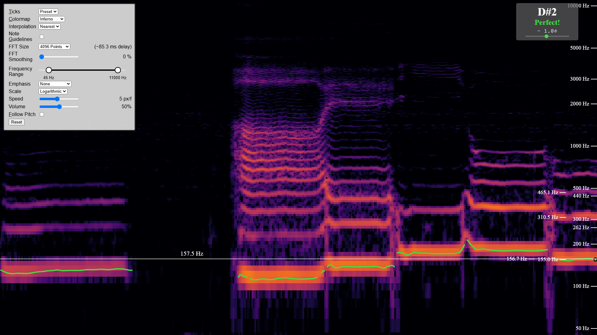

# Real-Time Audio Spectrogram

A real-time audio spectrogram visualizer built with Svelte 5, Bun, Typescript, WebGL2, and the Web Audio API.

This application provides a live analysis and visualization of your microphone input with some advanced features for musicians, voice coaches and audio enthusiasts.

Inspired by [Friture: A real-time audio analyzer](https://friture.org/) and [Praat: Doing Phonetics by Computer](http://www.praat.org/).




## Features

- **Real-time Audio Analysis**: Standard FFT-based frequency analysis

- **Multiple Visualization Modes**:
  - Linear, Logarithmic, and Mel frequency scales
  - Customizable frequency range (20Hz - 20kHz)
  - Adjustable FFT size and smoothing
  - Grayscale, Inferno, and Magma color maps

- **Musical Features**:
  - Note detection and pitch tracking
  - Musical note guidelines and frequency markers
  - Interactive pitch feedback with cents deviation
  - Reference tone generator with adjustable volume

- **Advanced Settings**:
  - Automatic pitch following
  - Customizable tick markers
  - Adjustable scroll speed
  - Multiple interpolation modes

- **Mobile Friendly**


## Usage

1. Allow microphone access when prompted by your browser
2. Click anywhere on the page to start the audio analysis
3. Use the settings panel on the left to customize the visualization:
   - Adjust frequency range
   - Increase the FFT resolution
   - Try to hit certain notes with the help of the note guidelines

### Keyboard Shortcuts

- `Space`: Pause/Resume the visualization
- `T`: Cycle through tick variants
- `C`: Switch color maps
- `G`: Toggle note guidelines
- `F`: Toggle pitch following


## Technical Details

### Core Technologies

- **Svelte 5**: UI framework and tool for building web applications
- **Bun**: Fast JavaScript all-in-one toolkit
- **WebGL2**: Performant graphics rendering
- **Web Audio API**: Real-time audio processing
- **TypeScript**: Type-safe JavaScript alternative

### Audio Processing Features

- Simple loudest frequency detection
- Fundamental frequency estimation (Custom variant of the Harmonic Product Spectrum)
- [Pitchy](https://github.com/ianprime0509/pitchy), implementing "A Smarter Way to Find Pitch" by Philip McLeod and Geoff Wyvill


## Installation

1. Clone the repository:
```bash
git clone https://github.com/Paul1365972/spectrogram.git
cd spectrogram
```

2. Install dependencies:
```bash
bun install
```

3. Start the development server:
```bash
bun dev
```


## Building

To create a production build:
```bash
bun run build
```

The built files will be in the `./dist/` directory.

You can also preview the production build using:
```bash
bun preview
```
