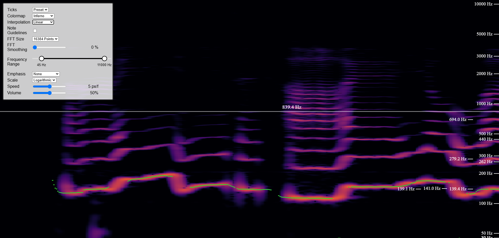

# Spectrogram

A voice spectrum analyser made using Typescript and Svelte 5.

Try it out here: [Github Pages Deployment](https://paul1365972.github.io/spectrogram/)

## Usage

All settings are configurable via the menu in the top left corner.

You can also press Space to pause the spectrogram.
